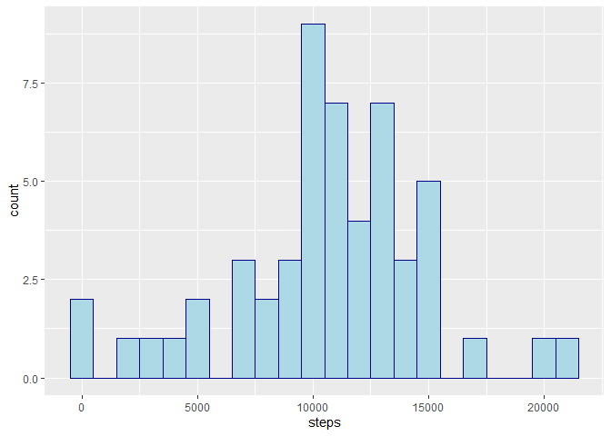
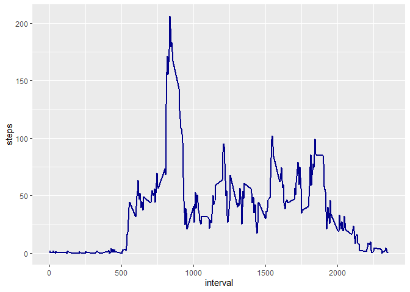
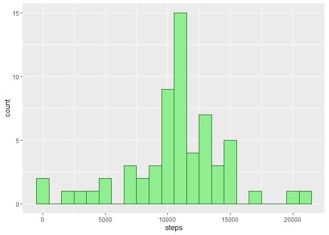
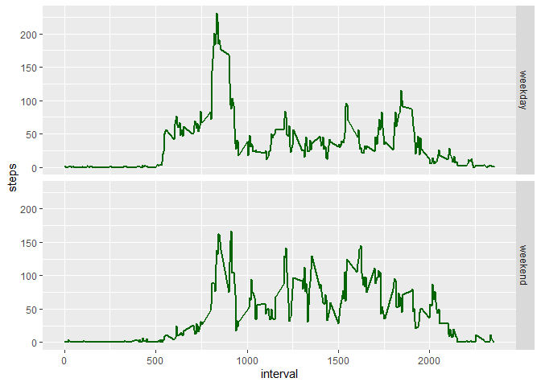

# Loading and preprocessing the data

Show any code that is needed to

1. Load the data (i.e. read.csv())


```r
ZipFile <- "./activity.zip"
CSV_File <- "./activity.csv"

# Download source ---------------------------------------------------------
if (!file.exists(CSV_File)) {
    unzip(ZipFile, overwrite = T)
}
```

2. Process/transform the data (if necessary) into a format suitable for your analysis


```r
# Read data ---------------------------------------------------------------
ActivityData <- read.csv(file = CSV_File,
                     sep = ',',
                     na.strings = "NA")
ActivityData$date <- as.Date(ActivityData$date, format = "%Y-%m-%d")
str(ActivityData)
```

```
## 'data.frame':	17568 obs. of  3 variables:
##  $ steps   : int  NA NA NA NA NA NA NA NA NA NA ...
##  $ date    : Date, format: "2012-10-01" "2012-10-01" ...
##  $ interval: int  0 5 10 15 20 25 30 35 40 45 ...
```

```r
summary(ActivityData)
```

```
##      steps             date               interval     
##  Min.   :  0.00   Min.   :2012-10-01   Min.   :   0.0  
##  1st Qu.:  0.00   1st Qu.:2012-10-16   1st Qu.: 588.8  
##  Median :  0.00   Median :2012-10-31   Median :1177.5  
##  Mean   : 37.38   Mean   :2012-10-31   Mean   :1177.5  
##  3rd Qu.: 12.00   3rd Qu.:2012-11-15   3rd Qu.:1766.2  
##  Max.   :806.00   Max.   :2012-11-30   Max.   :2355.0  
##  NA's   :2304
```

# What is mean total number of steps taken per day?

For this part of the assignment, you can ignore the missing values in the dataset.

1. Calculate the total number of steps taken per day
2. If you do not understand the difference between a histogram and a barplot, research the difference between them. Make a histogram of the total number of steps taken each day


```r
library(ggplot2)
DailySteps <- aggregate(steps ~ date, ActivityData, sum)
ggplot(DailySteps, aes(x = steps)) +
geom_histogram(color = "darkblue", fill = "lightblue", binwidth = 1000)
```

<!-- -->

3. Calculate and report the mean and median of the total number of steps taken per day


```r
mean(DailySteps$steps)
```

```
## [1] 10766.19
```


```r
median(DailySteps$steps)
```

```
## [1] 10765
```

# What is the average daily activity pattern?

1. Make a time series plot (i.e.type="l") of the 5-minute interval (x-axis) and the average number of steps taken, averaged across all days (y-axis)


```r
IntervalSteps <- aggregate(steps ~ interval, ActivityData, mean)
ggplot(IntervalSteps, aes(x = interval, y = steps)) +
    geom_line(color = "darkblue", size = 1)
```

<!-- -->

2. Which 5-minute interval, on average across all the days in the dataset, contains the maximum number of steps?


```r
IntervalSteps[IntervalSteps$steps == max(IntervalSteps$steps), "interval"]
```

```
## [1] 835
```

# Imputing missing values

Note that there are a number of days/intervals where there are missing values (coded as NA). The presence of missing days may introduce bias into some calculations or summaries of the data.

1. Calculate and report the total number of missing values in the dataset (i.e. the total number of rows with NAs)


```r
sum(is.na(ActivityData))
```

```
## [1] 2304
```

2. Devise a strategy for filling in all of the missing values in the dataset. The strategy does not need to be sophisticated. For example, you could use the mean/median for that day, or the mean for that 5-minute interval, etc.
3. Create a new dataset that is equal to the original dataset but with the missing data filled in.


```r
# Replace NAs with the mean for the interval
#
ActivityDataNoNAs <- ActivityData
ActivityDataNoNAs$steps[is.na(ActivityDataNoNAs$steps)] <- 
    IntervalSteps$steps[match(ActivityDataNoNAs$interval[is.na(ActivityDataNoNAs$steps)],IntervalSteps$interval)]
sum(is.na(ActivityDataNoNAs))
```

```
## [1] 0
```

4. Make a histogram of the total number of steps taken each day and Calculate and report the mean and median total number of steps taken per day. Do these values differ from the estimates from the first part of the assignment? What is the impact of imputing missing data on the estimates of the total daily number of steps?


```r
DailyStepsNoNAs <- aggregate(steps ~ date, ActivityDataNoNAs, sum)
ggplot(DailyStepsNoNAs, aes(x = steps)) +
geom_histogram(color = "darkgreen", fill = "lightgreen", binwidth = 1000)
```

<!-- -->

Mean of the total daily steps: 


```r
mean(DailyStepsNoNAs$steps)
```

```
## [1] 10766.19
```

Median of the total daily steps:


```r
median(DailyStepsNoNAs$steps)
```

```
## [1] 10766.19
```

**All NAs were replaced with mean values and therefore had no impact on the overall mean. However, due to the fact that missing days were replaced with average data, there are several days now with total of 10766.19 steps which happens to place the median at the same value as the mean.**


# Are there differences in activity patterns between weekdays and weekends?

For this part the weekdays() function may be of some help here. Use the dataset with the filled-in missing values for this part.

1.Create a new factor variable in the dataset with two levels – “weekday” and “weekend” indicating whether a given date is a weekday or weekend day.


```r
ActivityDataNoNAs$day <- ifelse(weekdays(ActivityDataNoNAs$date) %in%  c("Saturday", "Sunday"), 
                              "weekend", "weekday")
ActivityDataNoNAs$day <- as.factor(ActivityDataNoNAs$day)
```

2. Make a panel plot containing a time series plot (i.e. type="l") of the 5-minute interval (x-axis) and the average number of steps taken, averaged across all weekday days or weekend days (y-axis). See the README file in the GitHub repository to see an example of what this plot should look like using simulated data.


```r
IntervalStepsDayfactor <- aggregate(steps ~ interval + day, ActivityDataNoNAs, mean)
ggplot(IntervalStepsDayfactor, aes(x = interval, y = steps)) +
    geom_line(color = "darkgreen", size = 1) +
    facet_grid(day ~ .)
```

<!-- -->
